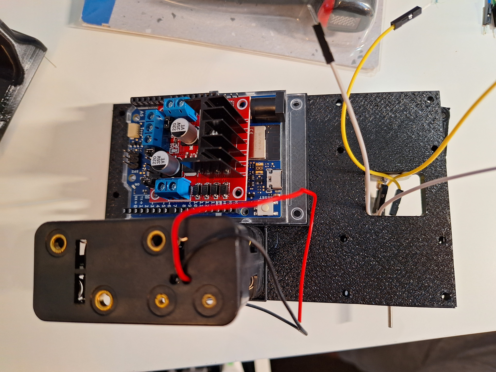

# The Sumo Bot 

### Objective: to battle the sumo bots against each other until one goes out of bounds or flipped!
## - Materials
- L298N H Bridge Motor Controller
- Arduino R4
- 3D printed chasis
- 3D printed wheels
- 3D printed plow
- 12V battery supply
- 2x 12v DC Motors
- Jumper wires

## Build Process

